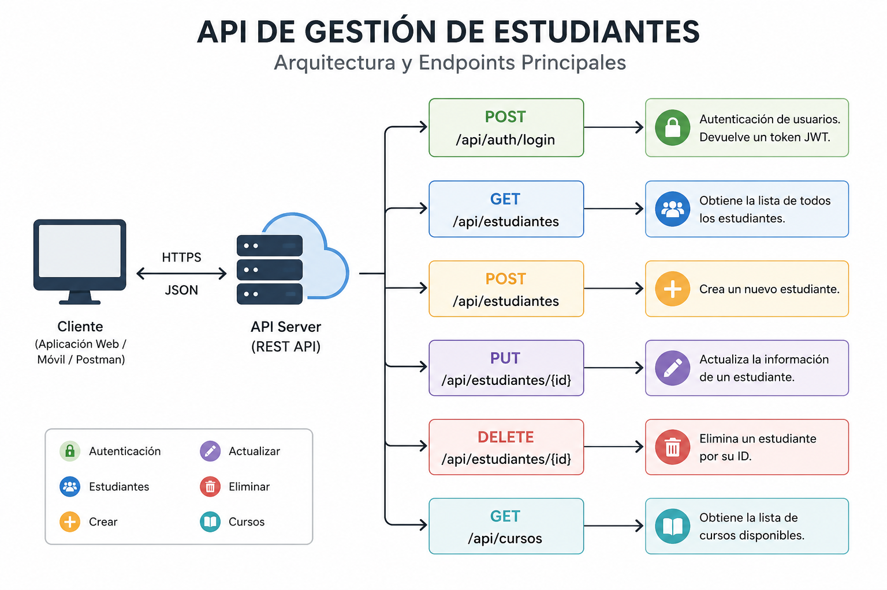

# Endpoints



## Consultar estudiantes

=== "GET"

    ```http
    GET /api/estudiantes
    ```

=== "Respuesta"

    ```json
    [
      {
        "id": 1,
        "nombre": "Juan Pérez"
      }
    ]
    ```

!!! warning

    Requiere autenticación.

Volver al [Inicio](index.md).